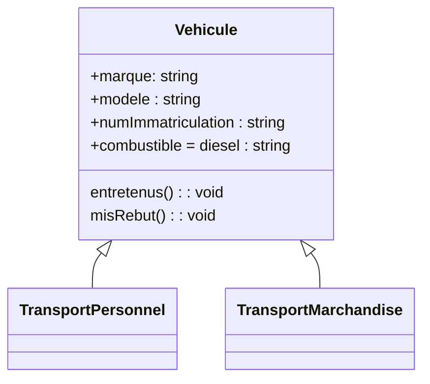

# TDs du Prof MADKOUR

## Des structures de contrôle et des structures de données en interaction

### Exercice 1:

1. Générer 100 nombres aléatoires compris entre 0 et 20 (notes d'étudiants dans un module)
2. Etablir la liste des notes supérieures ou égales à 10 (notes des étudiants ayant validé le mdule) et la liste des notes strictement inférieures à 10 (notes des étudiants n'ayant pas validé le module)
#### **Etape 1:** Générer des nombres aléatoires:

1. On importe le module numpy: import numpy as np

2. On fixe la valeur de la graine (à 0 par exemple): np.random.seed(0)

3. Utiliser la fonction randint pour générer des nombres aléatoires ( [cliquer ici pour accéder à la documentation](https://numpy.org/doc/stable/reference/random/generated/numpy.random.randint.html#numpy-random-randint/) )

#### **Etape 2 :** Créer 2 listes vides:

+ **`valide`** pour collecter les notes des étudiants ayant validé le module.

+ **`non_valide`** pour collecter les notes des étudiants n'ayant pas validé le module.

#### **Etape 3 :** A l'aide de boucle for, de test condtionnel if / elif / else et des méthodes des listes:

+ Affecter les notes qui sont supérieures ou égales à 10 à la liste **`valide`**.

+ Affecter les notes qui sont strictement inférieures à 10 à la liste **`non_valide`**.

### Exercice Statistique Descriptive

Ecrire une class  qui reçoit comme seul argument une liste de valeurs (de longueur arbitraire) et qui retourne les statistiques descriptives habituelles (moyenne arithmétique, écart type, coefficient d'asymétrie et coefficient d'aplatissement avec une interprétation de ces 2 derniers coefficients).

1. **La moyenne :**

```math

$$\bar{x} = \frac{\sum x_i \times n_i}{n}$$
```

2. **La variance :**

```math
$$Var = \frac{\sum x_i^2 \times n_i}{n}- \bar{x}^2$$

```

3. **L'écart-type :**

```math
$$\sigma = \sqrt{Var}$$

```

4. **Asymétrie d’une distribution statistique (Coefficient de Skewness) :**


```math
$$\gamma_1 = \frac{1}{n}\sum n_i \left( \frac{x_i -\bar{x}}{\sigma} \right)^3$$
```

- Si $\gamma_1 = 0$: la distribution est symétrique.
- Si $\gamma_1 > 0$: la distribution est asymétrique à droite.
- Si $\gamma_1 < 0$: la distribution est asymétrique à gauche.

5. **Aplatissement d’une distribution statistique (Coefficient de Kurtosis):**

```math
$$\beta_2 = \frac{1}{n}\sum n_i \left( \frac{x_i -\bar{x}}{\sigma} \right)^4$$
```

- Si $\beta_2 = 3$: distribution mésokurtique (courbe normale).
- Si $\beta_2> 3$: distribution leptokurtique (moins aplatie que la normale).
- Si $\\beta_2 < 3$: distribution platykurtique (plus aplatie que la normale).

## Les Mentions des étudients

Créer une fonction « resultats » qui simule les moyennes générales obtenues par les étudiants fictifs d'une
classe et qui retourne les mentions de ceux qui ont validé le semestre. On suppose que les moyennes générales
sont des nombres entiers compris entre 0 et 20.

La fonction « resultats » a un seul paramètre: le nombre d'étudiants à simuler (que l’on notera « nombre »), et retourne un dictionnaire « mentions » associant à chaque étudiant sa mention.
Voici quelques consignes à respecter :

- Importer le module numpy : **import numpy as np**
- Fixer la graine du générateur des nombres aléatoires à 0 : **np.random.seed(0)**
- Simuler les notes : **np.random.randint(low=0, high=20, size=nombre, dtype=int)**
- Stocker les notes dans une liste **« notes »**
- Créer la liste des étudiants : **etudiants =[ etudiant_1, etudiant_2, etudiant_3,…]**
- Créer les dictionnaires **« favorables »** et **« defavorables »** qui associent à chaque étudiant sa note et le
classent parmi ceux qui ont validé ou ceux qui n’ont pas validé le semestre.
- Créer le dictionnaire **« mentions »** qui attribue à chaque étudiant ayant validé le semestre la mention

obtenue comme suit :

<ul>
    <li><strong>Passable</strong> (10 ≤ 𝑛𝑜𝑡𝑒 < 12)</li>
    <li><strong>Assez bien</strong> (12 ≤ 𝑛𝑜𝑡𝑒 < 14)</li>
    <li><strong>Bien</strong> (14 ≤ 𝑛𝑜𝑡𝑒 < 16)</li>
    <li><strong>Très bien</strong> (16 ≤ 𝑛𝑜𝑡𝑒 < 18)</li>
    <li><strong>Excellent</strong> (18 ≤ 𝑛𝑜𝑡𝑒)</li>
</ul>

## Un exercice à préparer pour la POO

Une agence de location de véhicules loue 2 types de véhicules : des citadines pour le transport de personnes et des utilitaires pour le transport de marchandises. Les véhicules sont caractérisés par une marque, un modèle et un numéro d’immatriculation. Ils au diesel ou à l’essence, et doivent être entretenus tous les 10.000 km et mis au rebut au bout de 200.000km.
Votre mission est de concevoir un code Python pour le suivi de l’état de ces véhicules.


